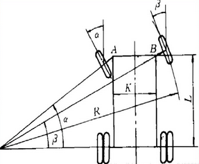
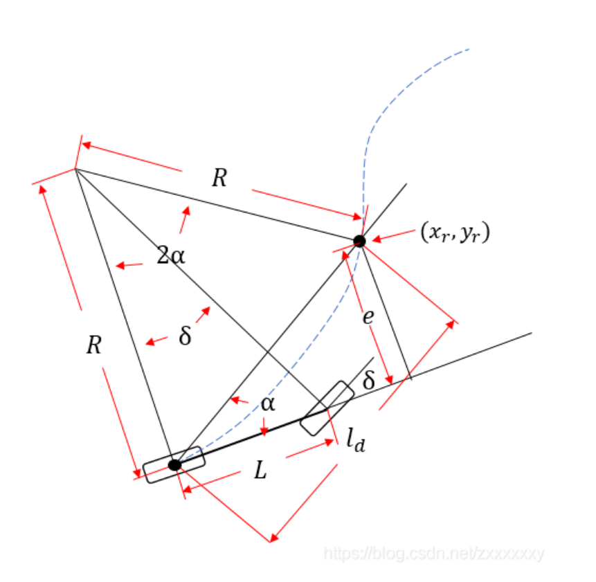

# PurePursuit 纯预瞄算法

## 阿克曼转向
> [阿克曼转向](https://blog.csdn.net/bisal/article/details/106232934)  
> 
阿克曼转向是一种现代汽车的转向方式，在汽车转弯的时候，内外轮转过的角度不一样，内侧轮胎转弯半径小于外侧轮胎。根据阿克曼转向几何设计的车辆，沿着弯道转弯时，利用四连杆的相等曲柄使内侧轮的转向角比外侧轮大大约2~4度，使四个轮子路径的圆心大致上交会于后轴的延长线上瞬时转向中心，让车辆可以顺畅的转弯.下图就是理想的阿克曼转向。 



$\alpha$汽车内轮转角  
$\beta$汽车外轮转角  
K两主销中心距离  
L轴距  
R转弯半径  

**转动形式**:
1. 仅前轮转向，后轮角度不变。
2. 前后轮均可转向。
3. (1) 前后轮角度相反，(2) 前后轮角度相同，这种模式可以实现全向运动。

**转向特性的特点**：
1. 汽车直线行驶时，4个车轮的轴线都互相平行，而且垂直于汽车纵向中心面。
2. 汽车在转向行驶过程中，全部车轮都必须绕一个瞬时中心点做圆周滚动。

**核心公式**  
- $\cot\beta - \cot\alpha = \cfrac{K}{L}$  

- $\tan\beta = \cfrac{L}{R}$    


## PurePursuit
> [纯预瞄算法](https://blog.csdn.net/zxxxxxxy/article/details/103665245)  
> 


上图所⽰为简化的车辆运动学⾃⾏车模型，其后轮中心在蓝⾊虚线表⽰的⽬标轨迹上。本算法**通过控制前轮转⻆来追踪下⼀个路点**，使车辆可以沿着经过⽬标预瞄点的圆弧⾏驶。

物理量描述如下:  
$R(m)$ 转弯半径  
$L(m)$ 轴距  
$\delta$ 前轮转角  
$l_d$ 预瞄距离  
$x_r$预瞄点横坐标  
$y_r$预瞄点纵坐标  
$e$横向偏差  
$\alpha$车身与预瞄点夹角  

本质就是已知轴距，预瞄距离，横向偏差求前轮转角:  
由正弦定理可以知道

- $\cfrac{l_d}{\sin2\alpha} = \cfrac{R}{\sin{\cfrac{\pi - 2\alpha}{2}}}$  
- $\cfrac{l_d}{2 * \sin\alpha * \cos\alpha} = \cfrac{R}{\cos\alpha}$  
- $R = \cfrac{l_d}{2 * \sin\alpha}$  

其中  
- $\sin\alpha = \cfrac{e}{l_d}$  

那么就有  
- $R = \cfrac{l_d^2}{2e}$  

所以  
- $\delta = \arctan\cfrac{L}{R} = \arctan\cfrac{2Le}{l_d^2}$  

由上式可知控制器的本质就是对转角进行控制，以减少横向误差为目标的横向控制器。其中$\cfrac{2L}{l_d^2}$可视为控制器的P参数.L为车辆轴距,$l_d$为设定的预瞄距离.本控制器的控制效果主要取决于预瞄距离的选取,⼀般来说预瞄距离越⻓,控制效果会越平滑,预瞄距离越短，控制效果会越精确（同时也会带来⼀定的震荡）.预瞄距离的选取也和当前车速有关,如以下两种:

- $l_d = gv + l_f$  

其中v为当前车速，g为⼀可调节的参数,$l_f$为预设前视距离

- $l_d = Av^2 + Bv + C$  

其中$A=1/(2a_{max})$, $a_{max}$为最⼤制动加速度.$Av^2$表⽰最短车辆制动距离.B表⽰车辆遇到异常时需要的反应时间, $Bv$则为对应的反应距离, $C$表⽰车辆的最⼩转弯半径.

在实际使用的时候，**通常不需要规划点切实等于预瞄点，而是在预瞄点附近找一个最接近的规划点，同时还可以用PID调整e值**。 

## 代码实现
### 预瞄
**输入自车经纬高以及目标点经纬高，计算车轮转角**
```c++
// 计算预瞄距离
double PurePursuit::cal_ld(double vel){
    return 1.0 / ( 2 * _max_braking_acc) * vel * vel + _reactime * vel + _min_turning_radius;
}
// http://www.movable-type.co.uk/scripts/latlong.html
// 计算gps两点距离
double PurePursuit::cal_gps_distance(double lng1, double lat1, double lng2, double lat2){
    double radius_of_earth = 6378137.0;
    lng1 = lng1 / 180 * M_PI;
    lat1 = lat1 / 180 * M_PI;
    lng2 = lng2 / 180 * M_PI;
    lat2 = lat2 / 180 * M_PI;

    double delt_lat = lat2 - lat1;
    double delt_lng = lng2 - lng1;
    double a = pow(sin(0.5 * delt_lat), 2) + pow(sin(0.5 * delt_lng), 2) * cos(lat1) * cos(lat2);
    double c = 2.0 * atan2(sqrt(a), sqrt(1.0 - a));
    return radius_of_earth * c;
}
// 计算gps两点方位角
double PurePursuit::cal_gps_bearing(double lng1, double lat1, double lng2, double lat2){
    lng1 = lng1 / 180 * M_PI;
    lat1 = lat1 / 180 * M_PI;
    lng2 = lng2 / 180 * M_PI;
    lat2 = lat2 / 180 * M_PI;

    double delt_lat = lat2 - lat1;
    double delt_lng = lng2 - lng1;
    double y = sin(delt_lng) * cos(lat2);
    double x = cos(lat1) * sin(lat2) - sin(lat1) * cos(lat2) * cos(delt_lng);
    return atan2(y, x);
 }
// 计算横向偏差，yaw为车辆的航向角，正北方向的偏航
double PurePursuit::cal_lateral(double lng1, double lat1, double lng2, double lat2, double yaw){
    double distance = cal_gps_distance(lng1, lat1, lng2, lat2);
    double heading = cal_gps_bearing(lng1, lat1, lng2, lat2);
    if (heading < 0) heading += 2 * M_PI;
    heading -= yaw;
    double x = sin(heading) * distance;
    double y = cos(heading) * distance;
    return y;
 }

// 计算车辆转角，vel自身车速
double PurePursuit::cal_wheel_angle(double lng1, double lat1, double lng2, double lat2, double vel, double yaw){
    double ld = cal_ld(vel);
    double lateral = cal_lateral(lng1, lat1, lng2, lat2, 0);
    return atan(2 * _wheel_base * lateral / ld / ld);
}
```
**实现2：转换utm坐标系且使用目标点航向计算**  
详细可操作代码见脚本lateral_controller.py

```python
    from pyproj import Proj

    proj_text = "+proj=utm +zone=50 +ellps=WGS84 +towgs84=0,0,0,0,0,0,0 +units=m +no_defs"
    trsfm = Proj(proj_text)
    path_point = read_global_path(log_path)

    # 全局路径转utm
    x, y = [], []
    for point in path_point:
        utm_x, utm_y = trsfm(point[0], point[1])
        x.append(utm_x)
        y.append(utm_y)
    x = np.array(x)
    y = np.array(y)

    # 计算预瞄距离
    ld = max(km.v * g_rate, 2)
    dx = km.x - x[target_pts_idx]
    dy = km.y - y[target_pts_idx]
    euler_dist = math.sqrt(dx**2 + dy**2)

    if euler_dist < ld:
        target_pts_idx += 1
        continue

    print(target_pts_idx, ld, euler_dist, dx, dy, km.x, km.y)

    cos_target_heading = cos(path_point[target_pts_idx][-1] * DEG_TO_RAD)
    sin_target_heading = sin(path_point[target_pts_idx][-1] * DEG_TO_RAD)

    # 计算横纵向偏差
    # lateral_error = cos_target_heading * dy - sin_target_heading * dx
    # print("lateral_error", lateral_error)
    lateral_error = cos_target_heading * dx - sin_target_heading * dy 
    longtidual_error = sin_target_heading * dx + cos_target_heading * dy
    
    print("lateral_error", lateral_error)
    # print("longtidual_error", longtidual_error)
    # print("euler_dist:", math.sqrt(dx**2 + dy**2))

    # 计算前轮转角
    alpha = atan(2 * 2.9 * lateral_error / euler_dist**2) + kp * lateral_error + ki * (lateral_error - last_error) + kd * (lateral_error - 2*(last_error) + last_last_error)
    alpha = min(alpha, 30 * DEG_TO_RAD)
    alpha = max(alpha, -30 * DEG_TO_RAD)


```

