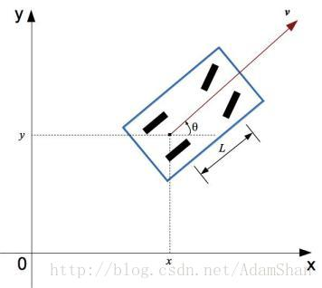
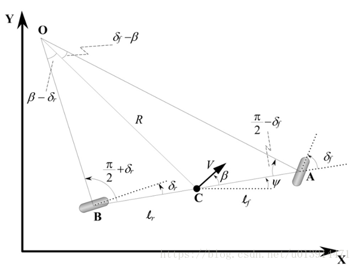

# 运动学模型

## 自行车模型
---
>  [自行车模型](https://blog.csdn.net/adamshan/article/details/78696874)  
>  [车辆运动学模型](https://blog.csdn.net/u013914471/article/details/82968608)
> 
自行车模型基于如下几个假设：

- 车辆在垂直方向的运动被忽略掉了，也就是说我们描述的车辆是一个二维平面上的运动物体（可以等价与我们是站在天空中的俯视视角）
- 假设车辆的结构就像自行车一样，也就是说车辆的前面两个轮胎拥有一直的角度和转速等，同样后面的两个轮胎也是如此，那么前后的轮胎就可以各用一个轮胎来描述
- 我们假设车辆运动也和自行车一样，这意味着是前面的轮胎控制这车辆的转角  




### 自行车运动学模型
---  
作为一种自行车模型，运动学自行车模型也假定车辆形如一辆自行车，整个的控制量可以简化为$\alpha, \delta_f, \delta_r$.其中$\alpha$是车辆的加速度，踩油门踏板意味着正的加速度，踩刹车踏板意味着负的加速度。$\delta_f$是前轮转角，$\delta_r$是后轮转角。这样我们使用三个量描述了车辆的控制输入(control input)，其中状态量我们用$\psi, V, x, y$来表示。



各变量说明如下：  
- $\delta_f$ 前轮转角
- $\delta_r$ 后轮转角
- $\psi$ 航向角
- $V$速度方向
- $\beta$ 速度方向与车辆方向夹角(滑移角)
- $l_r, l_f$ 质点到前后轴的距离
- $\omega$ 角速度
- $R$ 转弯半径
- $x, y$模型的位置

由三角函数可得：
$$
\begin{aligned}
    \dfrac{\sin(\delta_f - \beta)}{l_f} &=  \dfrac{\sin( \dfrac{\pi}{2} - \delta_f)}{R} \\
    \dfrac{\sin(\beta - \delta_r)}{l_r} &= \dfrac{\sin(\dfrac{\pi}{2} + \delta_r)}{R} \\
\end{aligned}
$$
展开：
$$
\begin{aligned}
    \dfrac{\sin\delta_f\cos\beta - \cos\delta_f\sin\beta}{l_f} &=  \dfrac{\cos\delta_f}{R} \qquad(1)\\
    \dfrac{\sin\beta\cos\delta_r - \cos\beta\sin\delta_r}{l_r} &= \dfrac{\cos\delta_r}{R} \qquad(2)\\
\end{aligned}
$$
可以求得$R, \beta$：  

0. $(1)$式同除$\delta_f$同乘$l_f$加上$(2)$式同除$\delta_r$同乘$l_r$得:
$$
\begin{aligned}
    \dfrac{l_f + l_r}{R} &= \cos\beta(\tan\delta_f - \tan\delta_r) \\
    R &= \dfrac{l_f + l_r}{\cos\beta(\tan\delta_f - \tan\delta_r)} \qquad(3) \\
\end{aligned}
$$
1. $(1)$式除以$(2)$式：
$$
\begin{aligned}
    \dfrac{\sin\delta_f\cos\beta - \cos\delta_f\sin\beta}{\sin\beta\cos\delta_r - \cos\beta\sin\delta_r} &=  \dfrac{\cos\delta_f * l_f}{\cos\delta_r * l_r} \\
\end{aligned}
$$
2. 等式同时除以$\cos\delta_f$，乘以$\cos\delta_r$得:  
$$
\begin{aligned}
    \dfrac{\tan\delta_f\cos\beta - \sin\beta}{\sin\beta - \cos\beta\tan\delta_r} &=  \dfrac{l_f}{l_r} \\
\end{aligned}
$$
3. 等式左边同时除以$\cos\beta$得:  
$$
\begin{aligned}
    \dfrac{\tan\delta_f - \tan\beta}{\tan\beta - \tan\delta_r} &=  \dfrac{l_f}{l_r} \\
\end{aligned}
$$
4. 合并整理得:  
$$
\begin{aligned}
    \tan\beta &=  \dfrac{l_r * \tan\delta_f + l_f * \tan\delta_r}{l_f + l_r} \\
    \beta &= \arctan(\dfrac{l_r * \tan\delta_f + l_f * \tan\delta_r}{l_f + l_r}) \qquad(4) \\
\end{aligned}
$$

低速环境下，车辆行驶路径的转弯半径变化缓慢，此时我们可以假设车辆的方向变化率等于车辆的角速度。则车辆的角速度$\omega$为
$$
\begin{aligned}
    \omega &= \dfrac{V}{R} \\
\end{aligned}
$$
代入$(3)$得:
$$
\begin{aligned}
    \omega &= \dfrac{V * \cos\beta * (\tan\delta_f - \tan\delta_r)}{l_f + l_r} \qquad(5)\\
\end{aligned}
$$
所以模型的状态量$x, y, \psi, V$的更新如下:  
$$
\begin{aligned}
    x_{t+1} &= x_t + V_t*\cos(\psi_t + \beta) * \Delta{t} \\
    y_{t+1} &= y_t + V_t*\sin(\psi_t + \beta) * \Delta{t} \\
    V_{t+1} &= V_t + \alpha * \Delta{t} \\
    \psi_{t+1} &= \psi_t + \omega * \Delta{t} \\
\end{aligned}
$$

当仅前轮驱动时，$\delta_r$可认为是0则$\psi, V, x, y$，更新公式如下：
$$
\begin{aligned}
    x_{t+1} &= x_t + V*\cos(\psi_t + \beta) * \Delta{t} \\
    y_{t+1} &= y_t + V*\sin(\psi_t + \beta) * \Delta{t} \\
    V_{t+1} &= V_t + \alpha * \Delta{t} \\
    \psi_{t+1} &= \psi_t + \frac{V_t}{l_f + l_r} * \cos(\beta) * \tan(\delta_f) * \Delta{t} \\
    \beta &= \arctan(\frac{l_r}{l_r+l_f} * \tan(\delta_f))
\end{aligned}
$$

### 代码实现
---

```python3
class KinematicModel(object):
    def __init__(self, x, y, psi, v, f_len, r_len):
        self.x = x
        self.y = y
        self.psi = psi
        self.v = v
`   
        self.f_len = f_len
        self.r_len = r_len

    def get_state(self):
        return self.x, self.y, self.psi, self.v

    def update_state(self, a, delta, dt):
        beta = math.atan((self.r_len / (self.r_len + self.f_len)) * math.tan(delta))
        self.x = self.x + self.v * math.cos(self.psi + beta) * dt
        self.y = self.y + self.v * math.sin(self.psi + beta) * dt
        self.psi = self.psi + (self.v / (self.f_len + self.r_len)) * math.cos(beta) * math.tan(delta) * dt
        self.v = self.v + a * dt
        return self.x, self.y, self.psi, self.v
```
