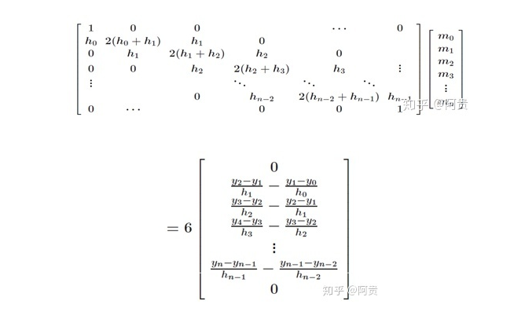
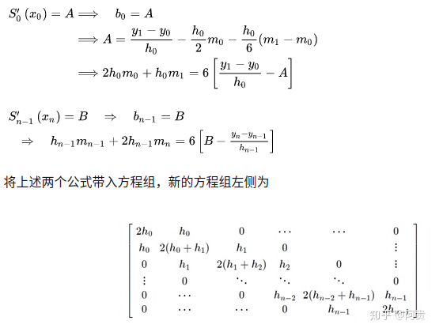
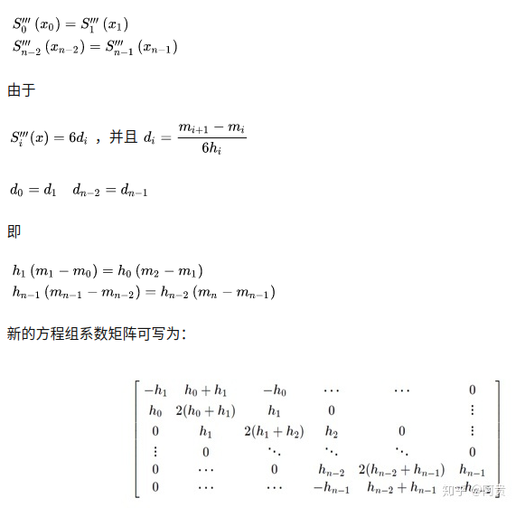

# 三次样条(cubic spline)插值
---
>  [样条插值](https://zhuanlan.zhihu.com/p/62860859)  
>  [PythonRobotics](https://github.com/fulincao/PythonRobotics)

已知某些点而不知道具体方程时候，通常有拟合和插值两种做法。拟合不要求方程通过所有的已知点，整体趋势一致。插值则是每个已知点都必会穿过，但是高阶会出现[龙格现象](https://baike.baidu.com/item/%E9%BE%99%E6%A0%BC%E7%8E%B0%E8%B1%A1/5473475?fr=aladdin)，所以一般采用分段插值。而三次样条插值则是分段采用一元三次方程进行插值

## 问题定义
---
已知n+1个点$[(x_0, y_0), (x_1, y_1),...,(x_{n-1}, y_{n-1}), (x_n, y_n)]$，n个区间段为$[(x0, x1), (x1, x2),...,(x_{n-1}, x_n)]$三次样条就是说每个小区间的曲线是一个三次方程，三次样条方程满足以下条件:  
1. 在每个分段小区间$[x_i, x_{i+1}], S(x)=S_i(x) = a_i + b_ix + c_ix^2 + d_ix^3$  
2. 满足插值条件，即$S(x_i) = y_i\qquad(i=0,1,...,n)$  
3. 曲线光滑，即$S(x), S'(x),S''(x)$连续  

每个区间$S_i(x)$都有个四个未知数$(a_i, b_i, c_i, d_i)$,有n个小区间，则有4n个未知数，要解出这些未知数，则我们需要4n个方程来求解。

## 求解
---
- 所有n-1个内部端点都满足$S_i(x_{i+1}) = y_{i+1}, S_{i+1}(x_{i+1})=y_{i+1}$,则有2*(n-1)个方程，再加上首尾两个端点分别满足第一个方程和最后一个方程，则有2*n个方程。
- 其次n-1个内部点的一阶导数应该是连续的，即在第i区间的末点和第i+1区间的起点是同一个点，它们的一阶导数应该也相等,即$S'_i(x_{i+1})=S'_{i+1}(x_{i+1})$ 则有n-1个方程。
- 其次n-1个内部点的二阶导数应该是连续的，即在第i区间的末点和第i+1区间的起点是同一个点，它们的二阶导数应该也相等,即$S''_i(x_{i+1})=S''_{i+1}(x_{i+1})$ 则有n-1个方程。

- 边界条件指定最后两个方程
    - 自然边界 ( Natural Spline )：指定端点二阶导数为0, $S''_0(x_0)) = 0 = S''_n(x_{n})$
    - 固定边界 ( Clamped Spline ): 指定端点一阶导数，这里分别定为A和B， $S'_0(x_0) = A, S'_n(x_{n}) = B$
    - 非扭结边界( Not-A-Knot Spline ): 强制第一个插值点的三阶导数值等于第二个点的三阶导数值，最后第一个点的三阶导数值等于倒数第二个点的三阶导数值.即 $S'''_0(x_0) = S'''_1(x_1), S'''_{n-1}(x_{n-1}) = S'''_n(x_n)$

由以上3点和边界边界条件便可以得到4n个方程。

## 具体推导
---
构造$S_i(x), S'_i(x), S''_i(x)$
$$
\begin{aligned}
    S_i(x) &= a_i + b_i(x-x_i) + c_i(x-x_i)^2 + d_i(x-x_i)^3 \qquad(1)\\
    S'_i(x) &= b_i + 2c_i(x-x_i) + 3d_i(x-x_i)^2 \\
    S''_i(x) &= 2c_i + 6d_i(x-x_i) \\
\end{aligned}
$$

1. 由$(1)$得
$$
\begin{aligned}
    S_i(x_i) &= a_i + b_i(x_i-x_i) + c_i(x_i-x_i)^2 + d_i(x_i-x_i)^3 = y_i \\
    \therefore a_i &= y_i \\
\end{aligned}
$$
2. 用$h_i=x_{i+1} - x_i$表示步长
$$
\begin{aligned}
    S_i(x_{i+1}) &= a_i + b_i(x_{i+1}-x_i) + c_i(x_{i+1}-x_i)^2 + d_i(x_{i+1}-x_i)^3 = y_{i+1} \\
    S_i(x_{i+1}) &= a_i + h_ib_i + h_i^2c_i + h_i^3d_i = y_{i+1} \\
    \therefore a_i + h_ib_i + h_i^2c_i + h_i^3d_i &= y_{i+1} \\
\end{aligned}
$$

3. 由$S'_i(x_{i+1})=S'_{i+1}(x_{i+1})$得到：
$$
\begin{aligned}
    S'_i(x_{i+1}) &= b_i + 2c_i(x_{i+1}-x_i) + 3d_i(x_{i+1}-x_i)^2  = b_i + 2h_ic_i +3h_i^2d_i\\
    S'_{i+1}(x_{i+1}) &= b_{i+1} + 2c_{i+1}(x_{i+1}-x_{i+1}) + 3d_{i+1}(x_{i+1}-x_{i+1})^2 \\
    \therefore b_i + 2h_ic_i +3h_i^2d_i &= b_{i+1} \\
\end{aligned}
$$
4. 由$S''_i(x_{i+1})=S''_{i+1}(x_{i+1})$得到：
$$
\begin{aligned}
    S''_i(x_{i+1}) &= 2c_i + 6d_i(x_{i+1}-x_i) \\
    S''_{i+1}(x_{i+1}) &= 2c_{i+1} + 6d_{i+1}(x_{i+1}-x_{i+1}) \\
    \therefore 2c_i + 6h_id_i &= 2c_{i+1} \\
\end{aligned}
$$
5. 设$m_i = S''_i(x_i) = 2*c_i$得到：
$$
\begin{aligned}
    2c_i + 6h_id_i &= 2c_{i+1} \\
    2m_i + 6h_id_i &= m_{i+1} \\
    \therefore d_i &= \dfrac{m_{i+1} - m_i}{6h_i}\\
    c_i &= \dfrac{1}{2}m_i \\
\end{aligned}
$$
6. 将$a_i,c_i,d_i$代入$a_i + h_ib_i + h_i^2c_i + h_i^3d_i = y_{i+1}$可得：
$$
\begin{aligned}
    y_i + h_ib_i + h^2_i*(\dfrac{1}{2}m_i) + h^3_i*(\dfrac{m_{i+1} - m_i}{6h_i}) &= y_{i+1} \\
    \therefore b_i &= \dfrac{y_{i+1} - y_i}{h_i} - \dfrac{h_i}{2}m_i - \dfrac{h_i}{6}(m_{i+1} - m_i)  \\
\end{aligned}
$$
7. 将$a_i,b_i,c_i,d_i$代入$b_i + 2h_ic_i +3h_i^2d_i = b_{i+1}$可得:
$$
\begin{aligned}
    \dfrac{y_{i+1} - y_i}{h_i} - \dfrac{h_i}{2}m_i - \dfrac{h_i}{6}(m_{i+1} - m_i) + 2h_i(\dfrac{1}{2}m_i) + 3h_i^2(\dfrac{m_{i+1} - m_i}{6h_i}) &= \dfrac{y_{i+2} - y_{i+1}}{h_{i+1}} - \dfrac{h_{i+1}}{2}m_{i+1} - \dfrac{h_{i+1}}{6}(m_{i+2} - m_{i+1}) \\
    h_im_i + 2(h_i + h_{i+1})m_{i+1} + h_{i+1}m_{i+2} &= 6(\dfrac{y_{i+2} - y_{i+1}}{h_{i+1}} - \dfrac{y_{i+1} - y_i}{h_i}) \\ 
\end{aligned} \\
$$
- 其中左边跟$m_i$相关，而右边都是已知的，因此可以构造一个以m为未知数的线性方程组

  - 在自然边界条件时, $m_0 = 0, m_n = 0$:  
    

    因此可以高斯消元,Givens Rotation等方式求得$m$从而得到$a_i,b_i,c_i,d_i$
  - 在夹持边界条件下：  
    

  - 在非扭结边界条件下：  
    


## 代码实现
```python
    import math
import numpy as np
import bisect


class Spline:
    """
    Cubic Spline class
    """
    def __init__(self, x, y):
        self.b, self.c, self.d, self.w = [], [], [], []

        self.x = x
        self.y = y

        self.nx = len(x)  # dimension of x
        h = np.diff(x) # x(i+1) - x(i)

        # calc coefficient c
        self.a = [iy for iy in y]

        # Ax = B
        A = self.__calc_A(h) 
        B = self.__calc_B(h)

        # 解Ax = B，得到的m = 2×c，再构建B的时候除了2,所以此处m = c
        self.c = np.linalg.solve(A, B)
        #  print(self.c1)

        # calc spline coefficient b and d
        for i in range(self.nx - 1):
            self.d.append((self.c[i + 1] - self.c[i]) / (3.0 * h[i]))
            tb = (self.a[i + 1] - self.a[i]) / h[i] - h[i] * \
                (self.c[i + 1] + 2.0 * self.c[i]) / 3.0
            self.b.append(tb)

    def calc(self, t):
        """
        Calc position

        if t is outside of the input x, return None

        """

        if t < self.x[0]:
            return None
        elif t > self.x[-1]:
            return None

        i = self.__search_index(t)
        dx = t - self.x[i]
        result = self.a[i] + self.b[i] * dx + \
            self.c[i] * dx ** 2.0 + self.d[i] * dx ** 3.0

        return result

    def calcd(self, t):
        """
        Calc first derivative

        if t is outside of the input x, return None
        """

        if t < self.x[0]:
            return None
        elif t > self.x[-1]:
            return None

        i = self.__search_index(t)
        dx = t - self.x[i]
        result = self.b[i] + 2.0 * self.c[i] * dx + 3.0 * self.d[i] * dx ** 2.0
        return result

    def calcdd(self, t):
        """
        Calc second derivative
        """

        if t < self.x[0]:
            return None
        elif t > self.x[-1]:
            return None

        i = self.__search_index(t)
        dx = t - self.x[i]
        result = 2.0 * self.c[i] + 6.0 * self.d[i] * dx
        return result

    def __search_index(self, x):
        """
        search data segment index
        """
        return bisect.bisect(self.x, x) - 1

    def __calc_A(self, h):
        """
        calc matrix A for spline coefficient c
        """
        A = np.zeros((self.nx, self.nx))
        A[0, 0] = 1.0
        for i in range(self.nx - 1):
            if i != (self.nx - 2):
                A[i + 1, i + 1] = 2.0 * (h[i] + h[i + 1])
            A[i + 1, i] = h[i]
            A[i, i + 1] = h[i]

        A[0, 1] = 0.0
        A[self.nx - 1, self.nx - 2] = 0.0
        A[self.nx - 1, self.nx - 1] = 1.0
        #  print(A)
        return A

    def __calc_B(self, h):
        """
        calc matrix B for spline coefficient c
        """
        B = np.zeros(self.nx)
        for i in range(self.nx - 2):
            B[i + 1] = 3.0 * (self.a[i + 2] - self.a[i + 1]) / \
                h[i + 1] - 3.0 * (self.a[i + 1] - self.a[i]) / h[i]
        return B
```


