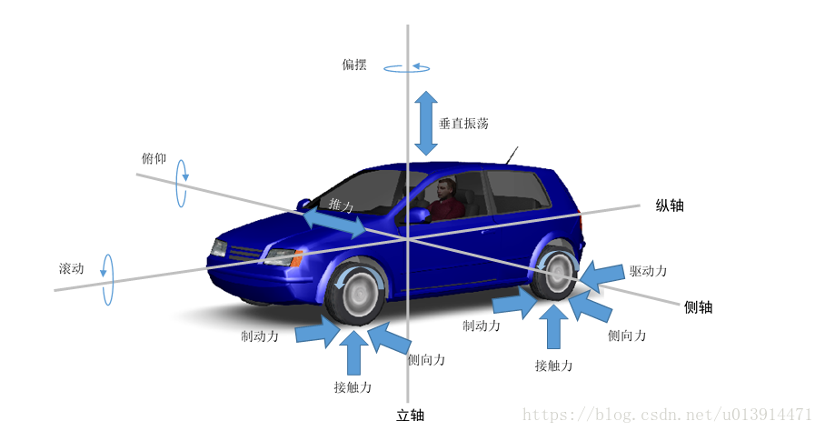
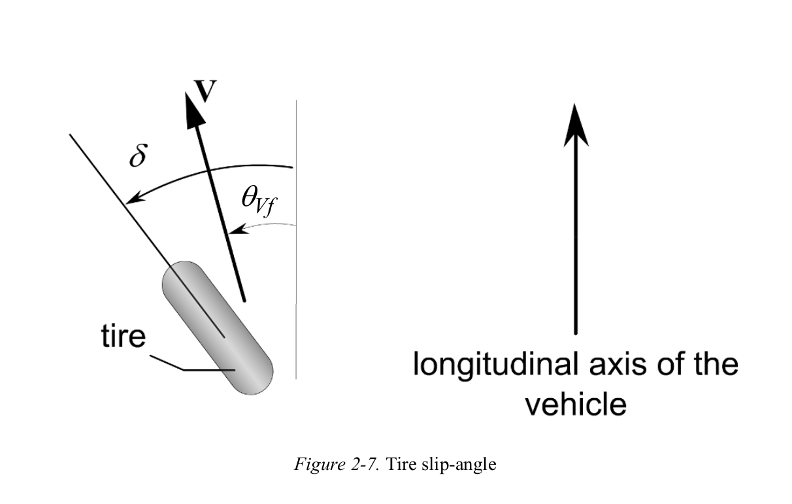
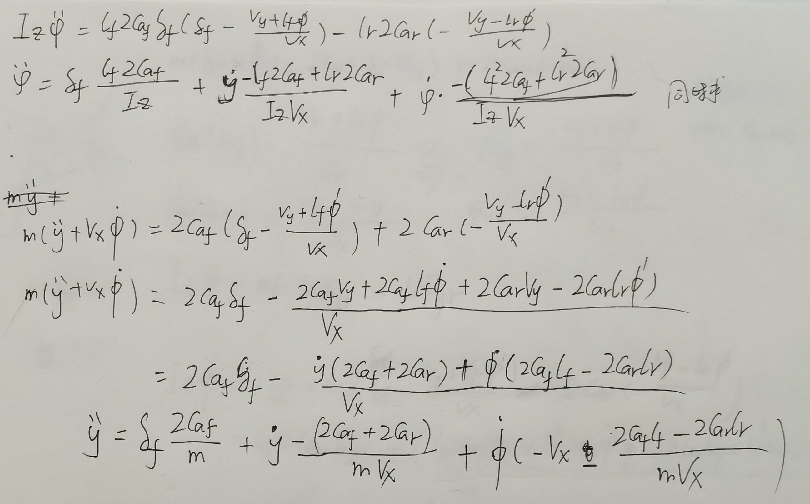
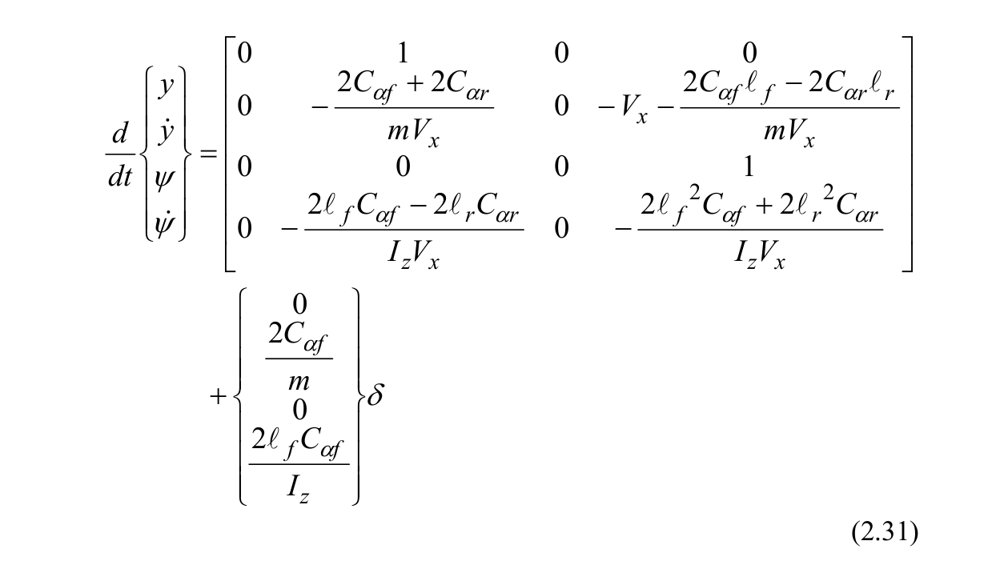

## 车辆动力学模型
---
>  [动力学模型](https://blog.csdn.net/u013914471/article/details/83018664)  


动力学主要研究作用于物体的力与物体运动的关系，车辆动力学模型一般用于分析车辆的平顺性和车辆操纵的稳定性。对于车来说，研究车辆动力学，主要是研究车辆轮胎及其相关部件的受力情况。比如纵向速度控制，通过控制轮胎转速实现；横向航向控制，通过控制轮胎转角实现。

正常情况下，车辆上的作用力沿着三个不同的轴分布：
- 纵轴上的力包括驱动力和制动力，以及滚动阻力和拖拽阻力作滚摆运动；
- 横轴上的力包括转向力、离心力和侧风力，汽车绕横轴作俯仰运动；
- 立轴上的力包括车辆上下振荡施加的力，汽车绕立轴作偏摆或转向运动




而在单车模型假设的前提下，再作如下假设即可简单搭建车辆的动力学模型：  
- 只考虑纯侧偏轮胎特性，忽略轮胎力的纵横向耦合关系；  
- 用单车模型来描述车辆的运动，不考虑载荷的左右转移；
- 忽略横纵向空气动力学。

其中需要考虑的受力点有：
- 横向运动：曲线行驶时的离心力，侧偏力等
- 纵向运动：受总驱动阻力、加速、减速等的影响。总驱动阻力由滚动阻力、拖拽阻力和坡度阻力等构成。


### 横向车辆动力学
---  


各变量说明如下：  
- $m, m_f, m_r$整车质量，前挂质量，后挂质量
- $\delta_f, \delta_r$ 前后轮转角
- $\alpha_f, \alpha_r$ 前后轮滑移角
- $C_{\alpha f}, C_{\alpha r}$ 前后轮侧偏刚度
- $\psi，\dot{\psi}$ 航向角，角速度
- $V_x, V_y$ 纵横向速度
- $F_{yf},F_{yr}$ 前后轮y方向受力
- $F_{cf},F_{cr}$ 前后轮侧向力
- $l_f, l_r$ 前后轴长度
- $I_z=m_f * l_{f}^2 + m_r * l_{r}^2$转动惯量

在y轴上：
$$
\begin{aligned}
    ma_y = F_{yf} + F_{y_r} \qquad(1)
\end{aligned}
$$
在z轴上：
$$
\begin{aligned}
    I_z\ddot{\psi} = l_f * F_{yf} - l_r * F_{yr} \qquad(2)
\end{aligned}
$$
y轴方向加速由y轴方向位移相关的加速度$\ddot{y}$和向心加速度$V_x\dot{\psi}$构成：
$$
\begin{aligned}
    a_y = \ddot{y} + V_x\dot{\psi} \qquad(3)
\end{aligned}
$$
即:
$$
\begin{aligned}
    m(\ddot{y} + V_x\dot{\psi}) =  F_{yf} + F_{y_r} \qquad(4)
\end{aligned}
$$

轮胎收到横向压力，会产生很小的滑移角


则前后轮滑移角(默认前轮驱动，后轮不动即后轮偏移角为0):
$$
\begin{aligned}
    \alpha_f &= \delta_f - \theta_{vf} \\
    \alpha_r &= - \theta_{vr}
\end{aligned}
$$
即前后轮所受横向力为：
$$
\begin{aligned}
    F_{yf} &= 2C_{\alpha f}(\delta_f - \theta_{vf}) \qquad(5)\\
    F_{yr} &= 2C_{\alpha r}(-\theta_{vr}) \qquad(6) \\
\end{aligned}
$$
其中$\theta_{vf},\theta_{vr}可以通过y方向速度和切线速度计算$：
$$
\begin{aligned}
    \tan(\theta_{vf}) = \dfrac{V_y + l_f\dot{\psi}}{V_x} \\
    \tan(\theta_{vr}) = \dfrac{V_y - l_r\dot{\psi}}{V_x}
\end{aligned}
$$
在小角度下，正切函数和正比例函数相似，因此可以近似为：
$$
\begin{aligned}
    \theta_{vf} = \dfrac{V_y + l_f\dot{\psi}}{V_x} \qquad(7) \\
    \theta_{vr} = \dfrac{V_y - l_r\dot{\psi}}{V_x} \qquad(8)
\end{aligned}
$$
将(5),(6),(7),(8)带入(1)(2)中得到:


整理得到动力学模型:



### 代码实现
---

```python3
'''
动力学模型模拟
'''
import math
import scipy.linalg as la
from numpy import fromiter


L = 4  # [m]
Lr = L / 2.0  # [m]
Lf = L - Lr
Cf = 1600.0 * 2.0  # N/rad
Cr = 1700.0 * 2.0  # N/rad
Iz = 1500 * 8  # kg * m^2 =  m_front * l_f^2 + m_rear * l_r^2
M = 1500.0 # kg
class DynamicsModel(object):

    def __init__(self, x=0.0, y=0.0, yaw=0.0, vx=0.01, vy=0.0, omega=0.0):
        self.x = x
        self.y = y
        self.yaw = yaw
        self.vx = vx
        self.vy = vy
        self.omega = omega


    def update_state(self, a, delta, dt=0.1):
        self.x = self.x + self.vx * math.cos(self.yaw) * dt - self.vy * math.sin(self.yaw) * dt
        self.y = self.y + self.vx * math.sin(self.yaw) * dt + self.vy * math.cos(self.yaw) * dt
        self.yaw = self.yaw + self.omega * dt
        Ffy = -Cf * math.atan2(((self.vy + Lf * self.omega) / self.vx - delta), 1.0)
        Fry = -Cr * math.atan2((self.vy - Lr * self.omega) / self.vx, 1.0)
        
        self.vx = self.vx + (a - Ffy * math.sin(delta) / M + self.vy * self.omega) * dt

        self.vy = self.vy + (Fry / M + Ffy * math.cos(delta) / M - self.vx * self.omega) * dt
        self.omega = self.omega + (Ffy * Lf * math.cos(delta) - Fry * Lr) / Iz * dt
        return self

    def get_state(self):
        return self.x, self.y, self.yaw, self.v
```
