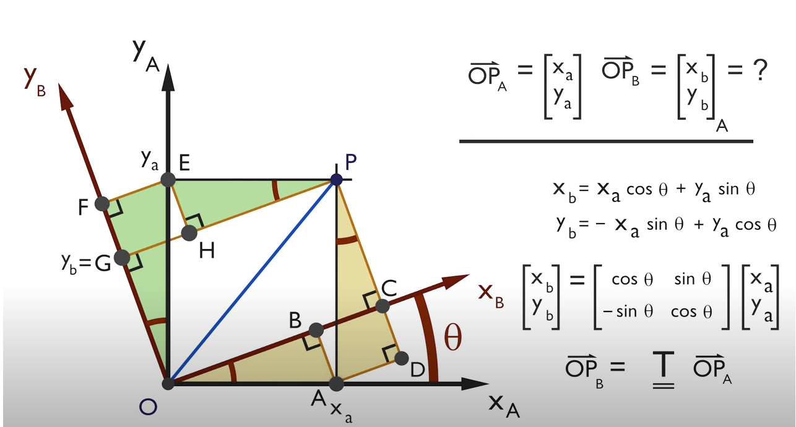
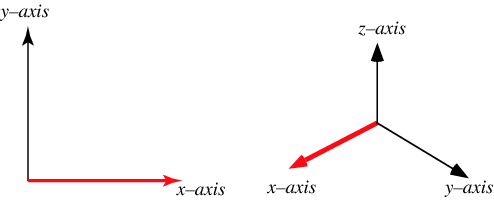

最近又碰到了**坐标变换**，发现已经忘了许多，在此在记录下。

常用的变换有: **平移**,**缩放**,**旋转**。
> [CSDN旋转矩阵](https://blog.csdn.net/ahelloyou/article/details/108903506)
> [mathworld旋转矩阵](https://mathworld.wolfram.com/RotationMatrix.html)

## 平移
平移直接加即可
$$
\begin{bmatrix}
x_b  \\
y_b  \\
z_b 
\end{bmatrix} =
\begin{bmatrix}
x_a  \\
y_a  \\
z_a 
\end{bmatrix} + 
\begin{bmatrix}
\Delta x  \\
\Delta y  \\
\Delta z
\end{bmatrix}
$$
其中$\Delta x,\Delta y,\Delta z$为b坐标轴在a坐标轴上的偏移。

## 缩放
缩放直接乘就好
$$
\begin{bmatrix}
x_b  \\
y_b  \\
z_b 
\end{bmatrix} =
\begin{bmatrix}
s_x & 0 & 0  \\
0 & s_y & 0  \\
0 & 0 & s_z
\end{bmatrix} 
\begin{bmatrix}
x_a  \\
y_a  \\
z_a 
\end{bmatrix} 
$$
其中$
s_x,s_y,s_x$为b坐标轴在a坐标轴上的缩放倍数。

## 旋转
> [欧拉角](https://en.wikipedia.org/wiki/Euler_angles)
> [旋转矩阵推导](https://www.youtube.com/watch?v=8XRvpDhTJpw&ab_channel=AdamLeeper) 

三维旋转可以分解为在三个不同的平面单独旋转:
- 在xy平面绕z轴逆时针旋转(heading或yaw)
      
    此时:
    $$
    \begin{aligned}
    x_b = OC &= OB + BC \\
    &= OB + AD \\ 
    &= x_a * \cos\theta + y_a * \sin\theta
    \end{aligned} 
    $$

    $$
    \begin{aligned}
    y_b = CP = OG &= OF - GF \\
    &= OF - HE \\ 
    &= y_a * \cos\theta - x_a * \sin\theta
    \end{aligned} 
    $$
    因此:
    $$
    \begin{bmatrix}
    x_b  \\
    y_b 
    \end{bmatrix} =
    \begin{bmatrix}
    \cos\theta &  \sin\theta \\
    -\sin\theta & \cos\theta  \\
    \end{bmatrix} * 
    \begin{bmatrix}
    x_a  \\
    y_a 
    \end{bmatrix} 
    $$
    转成三维令旋转方向为顺时针($\theta=-\theta$)有:
    $$
    tr_{yaw} = 
    \begin{bmatrix}
    \cos\theta &  -\sin\theta & 0 \\
    \sin\theta & \cos\theta & 0 \\
    0 & 0 & 1 
    \end{bmatrix} 
    $$

- 在zx平面绕y轴逆时针旋转(elevation或pitch)
      
    与z轴旋转一致，把z轴当成x, x轴当成y轴,因此有:
    $$
    tr_{pitch} = 
    \begin{bmatrix}
    \cos\theta &  0& \sin\theta \\
    0 & 1 & 0 \\
    -\sin\theta & 0 & \cos\theta
    \end{bmatrix} 
    $$
- 在yz平面绕x轴逆时针旋转(bank或roll)
      
    与z轴旋转一致，把y轴当成x, z轴当成y轴,因此有:
    $$
    tr_{roll} = 
    \begin{bmatrix}
    1 & 0 & 0 \\
    0 &\cos\theta &  -\sin\theta  \\
    0 & \sin\theta & \cos\theta \\
    \end{bmatrix} 
    $$

因此按ZYX顺序旋转得到的旋转矩阵为:
$$\begin{aligned}
    Z_{1}Y_{2}X_{3} = R &= tr_{yaw} * tr_{pitch} * tr_{roll} \\
    &= \begin{bmatrix}c_{1}c_{2}&c_{1}s_{2}s_{3}-c_{3}s_{1}&s_{1}s_{3}+c_{1}c_{3}s_{2}\\c_{2}s_{1}&c_{1}c_{3}+s_{1}s_{2}s_{3}&c_{3}s_{1}s_{2}-c_{1}s_{3}\\-s_{2}&c_{2}s_{3}&c_{2}c_{3}\end{bmatrix}
\end{aligned}       
$$
同时旋转矩阵转欧拉角为:
$$\begin{aligned}
yaw &=\arctan \left({\frac {R_{21}}{R_{11}}}\right) \\
pitch &=\arctan \left({\frac {-R_{31}}{\sqrt {1-R_{31}^{2}}}}\right) \\
roll &=\arctan \left({\frac {R_{32}}{R_{33}}}\right)\end{aligned}
$$
